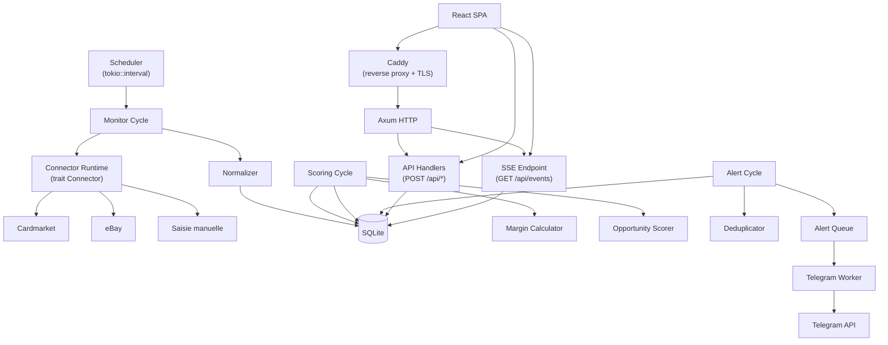
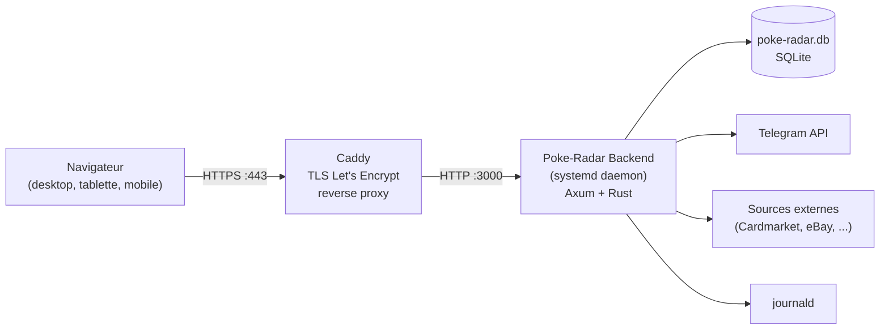
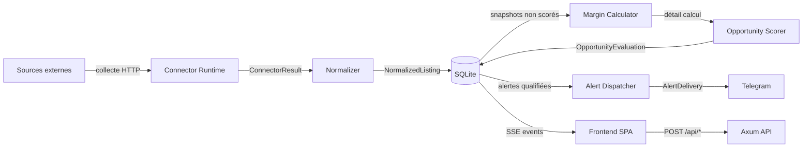

# Architecture — Poke-Radar

> **Note :** Ce document a été consolidé le 2026-07-23. L'architecture était auparavant shardée dans `architecture/architecture-Poke-Radar-2026-07-22/ARCHITECTURE-SPINE.md`. Les deux sources sont désormais unifiées ici. Le dossier sharded reste disponible pour référence historique.
>
> **Pivot documenté :** Le projet a pivoté de Tauri v2 desktop vers une application web (Axum + React SPA) déployée sur VPS. Toutes les décisions ci-dessous reflètent le pivot web.

---

## Design Paradigm

**Pipes-and-filters** pour le pipeline métier (ingestion → normalisation → scoring → alerting) : chaque étape est un filtre indépendant, testable isolément, avec interfaces de données stables entre étapes. Le scheduler pilote le flux.

**RPC léger** pour l'exposition web : le backend Rust expose des endpoints `POST /api/*` (pas de ressources CRUD REST), le frontend React/TypeScript consomme ces appels. Communication push via **Server-Sent Events** (`GET /api/events`) pour le temps réel.

Couches :
- `backend/src/app/` — handlers HTTP Axum + état applicatif
- `backend/src/domain/` — logique métier (modèles, services, politiques)
- `backend/src/connectors/` — adaptateurs par source (trait `Connector`)
- `backend/src/workflows/` — orchestration des cycles (monitor, scoring, alerting)
- `backend/src/infrastructure/` — persistance, télémétrie, secrets, notifications
- `frontend/src/pages/` — pages (Radar, Détail, Stratégie, Sources)
- `frontend/src/components/` — composants réutilisables
- `frontend/src/stores/` — état applicatif
- `frontend/src/services/` — appels API backend

## Invariants & Rules

### AD-1 — Stack applicatif web

- **Binds:** all
- **Prevents:** confusion sur le transport applicatif (Tauri desktop vs HTTP web) ou l'utilisation d'un framework REST lourd pour un besoin simple.
- **Rule:** Le backend utilise Axum (framework HTTP async Rust) exposant des endpoints RPC pragmatiques sous `POST /api/*`. La sérialisation passe par `serde` / `serde_json`. Le frontend est une SPA React/TypeScript construite avec Vite, servie comme ressource statique par le backend en production. Le domaine métier vit exclusivement en Rust.

### AD-2 — Déploiement et infrastructure

- **Binds:** all
- **Prevents:** divergence entre ce qui tourne en dev et en prod, ou fragilité opérationnelle (pas de redémarrage auto, pas de TLS).
- **Rule:** Le backend tourne comme un daemon systemd avec `Restart=always`. Caddy agit en reverse proxy, termine le TLS (Let's Encrypt automatique), et route toutes les requêtes vers le backend. Les logs applicatifs passent par journald (couche `tracing-subscriber` + `tracing-journald`). Le build est reproductible : `cargo build --release` produit le binaire. Les secrets (token Telegram, `POKE_RADAR_AUTH_TOKEN`, API keys) sont injectés via `EnvironmentFile` systemd, jamais dans le dépôt. Les migrations SQLite sont appliquées au démarrage.

### AD-3 — Authentification single-user par token statique

- **Binds:** FR-19, NFR-03
- **Prevents:** accès non authentifié à l'application exposée sur le web ; introduction prématurée d'un système multi-utilisateur complexe.
- **Rule:** Un secret unique `POKE_RADAR_AUTH_TOKEN` (variable d'environnement) est comparé côté backend. La SPA affiche une page de login minimaliste (champ de saisie token → `POST /api/auth/verify`). Si le token matche, le frontend le stocke en `localStorage` et l'envoie en header `Authorization: Bearer <token>` à chaque appel. Pas de cookie, pas de session serveur, pas de table users. Le token ne transite jamais dans l'URL.

### AD-4 — Pipeline modulaire

- **Binds:** FR-02, FR-03, FR-04, NFR-01, NFR-04
- **Prevents:** implémentations monolithiques où les étapes sont couplées, rendant impossible le test isolé ou le fallback partiel.
- **Rule:** Le pipeline suit l'ordre strict ingestion → normalisation → scoring → alerting. Chaque étape est un module distinct avec une interface d'entrée/sortie typée. Une étape peut échouer sans bloquer les autres (fallback par étape). Les contrats entre étapes sont : `ConnectorResult`, `NormalizedListing`, `OpportunityEvaluation`, `AlertDelivery`.

### AD-5 — Persistance SQLite locale

- **Binds:** FR-01, FR-04, FR-06, NFR-02
- **Prevents:** dépendance à une base externe (PostgreSQL, MySQL) ; perte de données lors des mises à jour.
- **Rule:** SQLite est la seule base de données. Le schéma est versionné via migrations, appliquées séquentiellement au démarrage du processus — avant le lancement du scheduler (`tokio::spawn`) et du serveur HTTP (`axum::serve`). Tous les timestamps sont UTC ISO-8601. Tous les montants sont en centimes (`i64`). Les calculs de marge sont persistés avec leur détail pour explicabilité. Indexation ciblée sur les colonnes utilisées par le dashboard et la déduplication d'alertes.

### AD-6 — Connecteurs par source

- **Binds:** FR-02, NFR-02, NFR-04
- **Prevents:** duplication des stratégies de résilience (retry/backoff) dans chaque connecteur ; impossibilité d'ajouter une source sans modifier le runtime.
- **Rule:** Chaque source (Cardmarket, eBay, saisie manuelle, etc.) implémente le trait Rust `Connector` : `collect()`, `map_to_normalized()`, `health()`, `typed_errors()`. Le runtime mutualise retry exponentiel avec jitter, circuit breaker léger, et quotas par source. L'état de santé (`ok`, `degraded`, `blocked`, `manual`) est exposé via `connector_health`.

### AD-7 — Moteur de marge nette centralisé

- **Binds:** FR-04, NFR-05
- **Prevents:** calculs de marge divergents entre UI, notifications Telegram et exports ; perte d'explicabilité (« pourquoi cette alerte ? »).
- **Rule:** Le calcul économique (prix achat, frais de port, commission plateforme, frais transaction, estimation revente) est effectué par un service Rust unique. Le détail du calcul est persisté avec chaque opportunité. Aucun calcul de marge n'est effectué côté frontend TypeScript.

### AD-8 — Alerting asynchrone avec anti-duplication

- **Binds:** FR-05, NFR-01
- **Prevents:** blocage du pipeline de détection par la latence de l'API Telegram ; spam d'alertes pour la même opportunité.
- **Rule:** Les alertes sont émises via une file interne + worker dédié, découplé du pipeline principal. La déduplication utilise une signature d'opportunité (produit + source + prix + fenêtre temporelle). Gestion retry/backoff par canal. Statuts d'envoi journalisés (`pending`, `sent`, `failed`, `suppressed`).

### AD-9 — Scheduler intégré au backend

- **Binds:** FR-02, NFR-01
- **Prevents:** dépendance à un orchestrateur externe (cron, Kubernetes) pour déclencher les cycles de collecte.
- **Rule:** Au démarrage, le backend lance une tâche `tokio::spawn` avec `tokio::time::interval` (cadence configurable). Le jitter et les quotas par source sont appliqués avant chaque cycle. Si le processus tombe, systemd le relance et le scheduler repart.

### AD-10 — Communication temps réel via Server-Sent Events

- **Binds:** FR-13, NFR-05
- **Prevents:** polling HTTP coûteux côté client ; délai entre une alerte backend et son affichage UI.
- **Rule:** Le backend expose `GET /api/events` en SSE. Les événements poussés : `opportunity.new`, `opportunity.updated`, `alert.sent`, `source.health_changed`. Le frontend utilise l'API `EventSource` native du navigateur. Pas de WebSocket (pas de besoin bidirectionnel). Les actions utilisateur restent en `POST /api/*`.

### AD-11 — Environnement unique

- **Binds:** NFR-06
- **Prevents:** complexité de gestion de configuration multi-environnements disproportionnée pour le besoin.
- **Rule:** Un seul environnement (le VPS de production). La configuration est entièrement portée par les variables d'environnement injectées par systemd (`EnvironmentFile`). Pas de profils, pas de fichiers `.env.dev` / `.env.prod`.

### AD-12 — Structure du projet

- **Binds:** all
- **Prevents:** mélange des responsabilités backend/frontend ; dépendances circulaires.
- **Rule:** Le dépôt est organisé en workspace classique :
  - `backend/` — crate Cargo avec `src/app/`, `src/domain/`, `src/connectors/`, `src/workflows/`, `src/infrastructure/`
  - `frontend/` — projet Vite + React/TypeScript
  - En production, le backend sert `frontend/dist/` comme ressources statiques.

### AD-13 — Tests unitaires Rust

- **Binds:** FR-08, AD-7
- **Prevents:** régressions silencieuses sur le calcul économique et le scoring.
- **Rule:** Chaque fonction du domaine métier (marge, scoring, normalisation, déduplication) est couverte par des tests `#[cfg(test)]` dans le même fichier. Minimum un cas nominal + un cas outlier par règle de calcul. Les connecteurs sont testés avec des fixtures HTTP mockées (`httpmock` ou `wiremock`).

### AD-14 — Tests d'intégration Rust

- **Binds:** AD-4, AD-5
- **Prevents:** défauts d'intégration entre les étapes du pipeline non détectés avant déploiement.
- **Rule:** Tests dans `backend/tests/` exécutant le pipeline complet sur des données de test. Base SQLite en mémoire (`:memory:`) pour l'isolation des tests d'intégration. Les connecteurs externes sont mockés, le reste du pipeline est réel.

### AD-15 — Tests frontend

- **Binds:** NFR-07
- **Prevents:** régressions visuelles ou fonctionnelles sur les composants partagés utilisés par plusieurs pages.
- **Rule:** Vitest + React Testing Library pour les tests unitaires de composants. Chaque composant partagé est testé pour ses états (default, disabled, loading, error, success). Les pages sont testées avec MSW (Mock Service Worker) pour simuler le backend. Pas de tests de rendu visuel (snapshots).

### AD-16 — Tests end-to-end

- **Binds:** FR-01..FR-19, all user journeys
- **Prevents:** défauts d'intégration backend ↔ frontend non détectés avant déploiement ; régressions sur les parcours utilisateur clés.
- **Rule:** Playwright exécute les 4 journeys utilisateur (alerte → décision, recalibrage, source indisponible, saisie manuelle). Le backend réel est lancé avant les tests. La base SQLite de test est recréée à chaque run. Les connecteurs sont mockés au niveau HTTP (pas d'appels réels aux sources externes).

### AD-17 — Sécurité web

- **Binds:** FR-19, NFR-03
- **Prevents:** exposition non sécurisée de l'application sur le web public.
- **Rule:** CORS restreint au domaine configuré (pas de wildcard `*`). Rate limiting par IP sur `POST /api/auth/verify` et `POST /api/scan`. Toutes les requêtes SQL utilisent des requêtes paramétrées (pas de concaténation de chaînes). Header `Content-Security-Policy` restrictif. HTTPS obligatoire (terminé par Caddy). La protection CSRF n'est pas nécessaire (pas de cookies, token en header `Authorization`).

### AD-18 — Conventions de nommage et formats

- **Binds:** all
- **Prevents:** divergence de style entre agents travaillant sur le même codebase.
- **Rule:**
  - Rust : `snake_case`
  - TypeScript : `camelCase`
  - SQL : `snake_case` explicite
  - Erreurs API : format uniforme `{ "error": string, "code": string }`
  - Montants : centimes (`i64`)
  - Timestamps : UTC ISO-8601
  - `correlation_id` unique par cycle de collecte et par opportunité, injecté dans les logs et les événements pour traçabilité.

## Consistency Conventions

| Concern | Convention |
| --- | --- |
| Naming (entities, files, interfaces, events) | Rust `snake_case`, TypeScript `camelCase`, SQL `snake_case`. Fichiers Rust = `snake_case.rs`, composants React = `PascalCase.tsx`. Événements SSE = `domain.action` (ex: `opportunity.new`). |
| Data & formats (ids, dates, error shapes, envelopes) | Montants en centimes (`i64`). Timestamps UTC ISO-8601. IDs auto-incrément `INTEGER PRIMARY KEY`. Erreurs API uniformes `{ error, code }`. Réponses API wrappées : `{ ok: true, data: ... }` ou `{ ok: false, error: ..., code: ... }`. |
| State & cross-cutting (mutation, errors, logging, config, auth) | Mutation d'état via le backend uniquement (pas d'écriture directe SQLite par le frontend). Logging structuré via `tracing` (niveaux : error, warn, info, debug). Configuration : variables d'environnement exclusivement. Auth : header `Authorization: Bearer <token>` sur chaque appel API. |

## Stack

| Name | Version |
| --- | --- |
| Rust | stable (latest) |
| Axum | 0.8 |
| Tokio | 1.x (latest stable) |
| rusqlite | 0.32 |
| serde / serde_json | 1.x |
| tracing / tracing-subscriber / tracing-journald | 0.1 / 0.3 / 0.3 |
| React | 19 |
| TypeScript | 5.8 |
| Vite | 6 |
| Vitest | 3 |
| React Testing Library | 16 |
| MSW (Mock Service Worker) | 2.x |
| Playwright | 1.52 |
| Caddy | 2.x |
| SQLite | 3.x (système) |

> Les versions marquées `latest stable` ou sans numéro précis sont à vérifier avant implémentation. Les versions numérotées sont des hypothèses (recherche web indisponible lors de la rédaction).

## Structural Seed

### Arborescence du dépôt

```text
poke-radar/
  backend/                       # Crate Rust — Axum + domaine métier
    Cargo.toml
    src/
      main.rs                    # Point d'entrée : init config, DB, scheduler, serveur HTTP
      app/
        router.rs                # Définition des routes Axum
        state.rs                 # AppState partagé
        handlers/
          auth.rs                # POST /api/auth/verify
          scan.rs                # POST /api/scan
          strategy.rs            # POST /api/strategy/*
          opportunities.rs       # POST /api/opportunities/*
          sources.rs             # POST /api/sources/*
          events.rs              # GET /api/events (SSE)
        middleware/
          auth.rs                # Extraction + validation Bearer token
          rate_limit.rs          # Rate limiting par IP
      domain/
        models/
          product.rs
          source.rs
          monitor_profile.rs
          listing_snapshot.rs
          opportunity.rs
          alert.rs
        services/
          normalizer.rs          # Normalisation devises, formats
          margin_calculator.rs   # Calcul marge nette (AD-7)
          opportunity_scorer.rs  # Scoring priorisé
          deduplicator.rs        # Signature + fenêtre temporelle
        policies/
          rate_policy.rs         # Quotas et jitter par source
          alert_policy.rs        # Règles de seuil et suppression
      connectors/
        mod.rs                   # Trait Connector
        cardmarket.rs
        ebay.rs
        manual.rs                # Connecteur saisie manuelle
        runtime.rs               # Orchestrateur : retry, backoff, circuit breaker
      workflows/
        monitor_cycle.rs         # Cycle complet ingestion → stockage
        scoring_cycle.rs         # Évaluation des snapshots non scorés
        alert_cycle.rs           # Émission des alertes qualifiées
      infrastructure/
        db/
          mod.rs                 # Initialisation connexion + migrations
          migrations/
            001_initial.sql
          repositories/
            product_repo.rs
            source_repo.rs
            opportunity_repo.rs
            alert_repo.rs
        telemetry/
          mod.rs                 # Initialisation tracing → journald
        secrets/
          mod.rs                 # Lecture variables d'environnement
        notifications/
          mod.rs
          telegram.rs            # Worker Telegram (AD-8)
    tests/
      integration/
        pipeline.rs              # Test pipeline complet (AD-14)
        auth.rs
  frontend/                      # SPA React/TypeScript — Vite
    package.json
    vite.config.ts
    tsconfig.json
    index.html
    src/
      main.tsx                   # Point d'entrée React
      App.tsx                    # Routing + Auth guard
      pages/
        LoginPage.tsx
        RadarPage.tsx
        DetailPage.tsx
        StrategyPage.tsx
        SourcesPage.tsx
      components/
        shared/
          Badge.tsx
          Button.tsx
          Card.tsx
          Toast.tsx
          EmptyState.tsx
          BottomSheet.tsx
          CollapsibleSection.tsx
          ConfidenceBadge.tsx
          SignalBadge.tsx
          StatusPill.tsx
          Feedback.tsx
        opportunity/
          OpportunityRow.tsx
          OpportunityCard.tsx
          MarginBreakdown.tsx
          Sparkline.tsx
        source/
          SourceCard.tsx
          SourceHealthPanel.tsx
        strategy/
          StrategyPresetPanel.tsx
          NotificationPreview.tsx
      stores/
        authStore.ts
        opportunityStore.ts
        sourceStore.ts
        strategyStore.ts
      services/
        api.ts                   # Wrapper fetch + Bearer token
        sse.ts                   # EventSource wrapper
      hooks/
        useInfiniteScroll.ts
        useSwipe.ts
        useCollapsible.ts
    tests/
      components/                # Vitest + RTL (AD-15)
      mocks/
        handlers.ts              # MSW handlers
        server.ts                # MSW server setup
  e2e/                           # Playwright (AD-16)
    playwright.config.ts
    tests/
      journey-01-alert-to-decision.spec.ts
      journey-02-recalibration.spec.ts
      journey-03-source-down.spec.ts
      journey-04-manual-entry.spec.ts
    fixtures/
      auth.setup.ts
  Caddyfile                      # Configuration Caddy
  poke-radar.service             # Fichier unité systemd
```

### Diagramme de dépendances



### Vue déploiement



## Diagramme de flux de données



## Capability → Architecture Map

| Capability / Area | Lives in | Governed by |
| --- | --- | --- |
| FR-01 — Configuration & référentiels | `backend/src/domain/models/`, `frontend/src/pages/StrategyPage.tsx` | AD-5, AD-12 |
| FR-02 — Collecte de données | `backend/src/connectors/`, `backend/src/workflows/monitor_cycle.rs` | AD-4, AD-6, AD-9 |
| FR-03 — Estimation marché | `backend/src/domain/services/normalizer.rs` | AD-4, AD-7 |
| FR-04 — Scoring d'opportunité | `backend/src/domain/services/margin_calculator.rs`, `opportunity_scorer.rs` | AD-7, AD-13 |
| FR-05 — Notification | `backend/src/infrastructure/notifications/`, `backend/src/workflows/alert_cycle.rs` | AD-8 |
| FR-06 — Tableau de bord | `frontend/src/pages/RadarPage.tsx`, `GET /api/events` (SSE) | AD-10 |
| FR-07 — Résilience opérationnelle | `backend/src/connectors/runtime.rs` | AD-6 |
| FR-08 — Exposition web | `Caddyfile`, `poke-radar.service`, `backend/src/app/` | AD-1, AD-2 |
| FR-09 — Authentification | `backend/src/app/middleware/auth.rs`, `frontend/src/pages/LoginPage.tsx` | AD-3 |
| NFR-01 — Performance | Scheduler (AD-9), Pipeline modulaire (AD-4), SSE (AD-10) | AD-4, AD-9, AD-10 |
| NFR-02 — Fiabilité | Connector runtime (AD-6), déduplication (AD-8), SQLite (AD-5) | AD-5, AD-6, AD-8 |
| NFR-03 — Sécurité & conformité | Middleware auth (AD-3), CORS/Rate limit (AD-17), HTTPS (AD-2) | AD-2, AD-3, AD-17 |
| NFR-04 — Maintenabilité | Pipeline modulaire (AD-4), trait Connector (AD-6) | AD-4, AD-6 |
| NFR-05 — UX | Design system (DESIGN.md), composants (AD-15), SSE (AD-10) | AD-10, AD-15 |
| NFR-06 — Déploiement et exploitation | systemd (AD-2), Caddy (AD-2), migrations (AD-5) | AD-2, AD-5 |

## Deferred

| Item | Reason |
| --- | --- |
| Abstraction multi-canaux de notification (Discord, email, push) | MVP = Telegram uniquement. L'interface `Notifier` pourra être introduite quand un second canal sera nécessaire. |
| Multi-utilisateur avec rôles | Le passage de single-user à multi-user touche auth, modèles, et isolation des données — à traiter comme une feature complète, pas une décision d'architecture anticipée. |
| Auto-buy / exécution automatique d'achat | Hors scope MVP (PRD). Nécessiterait une couche de transaction avec état et rollback, pas juste une décision d'architecture. |
| Client desktop natif (Tauri) | L'architecture web actuelle remplace le besoin desktop. Si un client offline redevient nécessaire, il consommera l'API existante sans changement de spine. |
| Couverture multi-pays / multi-langues au-delà de FR/CH | L'architecture i18n est anticipée côté frontend (React Intl ou similaire), mais la couverture effective est différée. |
| Environnement de staging/dev | AD-11 dit env unique. Si le besoin émerge, un deuxième fichier `.env` + un deuxième service systemd sur un autre port suffiront. |
| Observabilité avancée (metrics Prometheus, dashboards) | journald + tracing couvrent le besoin MVP. Prometheus/Grafana ajoutés si le monitoring l'exige. |
| CI/CD pipeline | Le build reproductible (`cargo build --release`) est documenté. L'automatisation CI (GitHub Actions ou similaire) est laissée au workflow de développement. |
